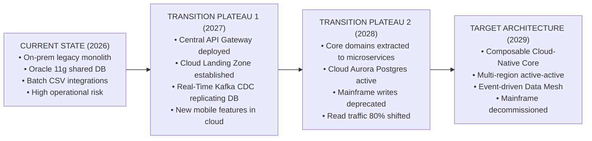

# Current State, Target State, and Transition Architectures

Why target architecture alone is useless without well-architected intermediate transition plateaus.

---

## 1. The Transition Plateau Architecture

---

## 2. Invariants for Transition Plateaus
* **Each Plateau Must Deliver Standalone Business Value**: If funding is cut after Plateau 1, the enterprise must still enjoy tangible business and operational benefits.
* **Zero Disruption to Active Business Operations**: Transition plateaus must maintain full backward compatibility via Anti-Corruption Layers and bi-directional data replication.
