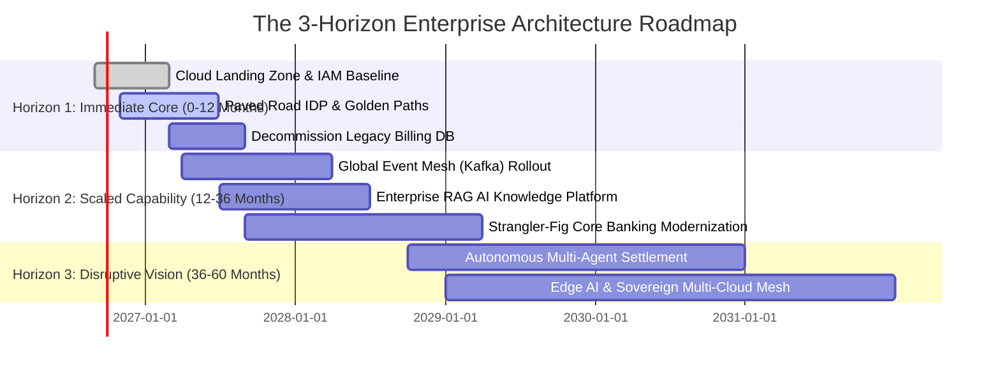

# Roadmap Development Methodology

How to build dynamic, multi-horizon architecture roadmaps that adapt to market disruptions.

---

## 1. The 3-Horizon Architecture Roadmap Framework

```mermaid
gantt
    title The 3-Horizon Enterprise Architecture Roadmap
    dateFormat  YYYY-MM-DD
    section Horizon 1: Immediate Core (0-12 Months)
    Cloud Landing Zone & IAM Baseline       :done,    h1_1, 2026-09-01, 2027-02-28
    Paved Road IDP & Golden Paths           :active,  h1_2, 2026-11-01, 2027-06-30
    Decommission Legacy Billing DB          :         h1_3, 2027-03-01, 2027-08-31
    section Horizon 2: Scaled Capability (12-36 Months)
    Global Event Mesh (Kafka) Rollout       :         h2_1, 2027-04-01, 2028-03-31
    Enterprise RAG AI Knowledge Platform    :         h2_2, 2027-07-01, 2028-06-30
    Strangler-Fig Core Banking Modernization:         h2_3, 2027-09-01, 2029-03-31
    section Horizon 3: Disruptive Vision (36-60 Months)
    Autonomous Multi-Agent Settlement       :         h3_1, 2028-10-01, 2030-12-31
    Edge AI & Sovereign Multi-Cloud Mesh    :         h3_2, 2029-01-01, 2031-12-31
```
