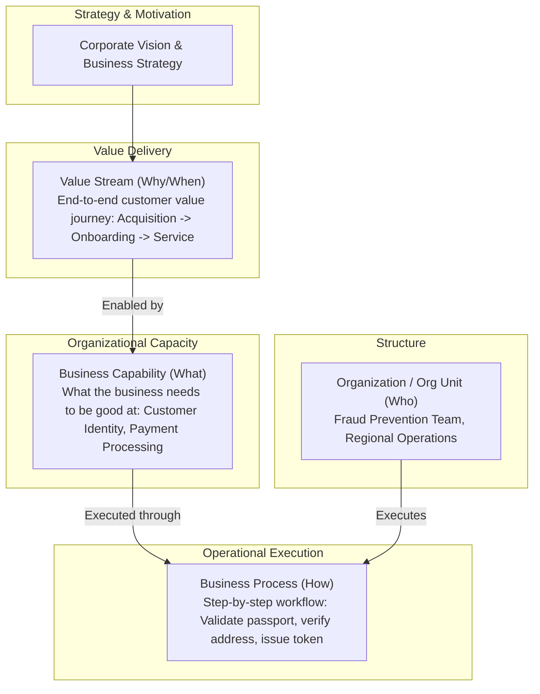

# Business Architecture

Business Architecture is the foundational domain of Enterprise Architecture that represents how an organization generates value, organizes its capabilities, structures its operating model, and aligns technology with corporate business strategy.

---

## 1. The Core Distinctions: Process vs Capability vs Value Stream

---

## 2. Directory Contents

* **[business-strategy-and-motivation.md](business-strategy-and-motivation.md)**: Business Motivation Model (BMM), goals, drivers, objectives, and SWOT-to-architecture translation.
* **[business-models-and-canvases.md](business-models-and-canvases.md)**: Business Model Canvas (BMC), customer segments, cost structures, and revenue streams.
* **[process-vs-capability-vs-value-stream.md](process-vs-capability-vs-value-stream.md)**: Exhaustive taxonomy and boundary definitions preventing conceptual conflation.
* **[industry-business-architectures.md](industry-business-architectures.md)**: Standard domain capability models across 8 major industries (Banking, Insurance, Healthcare, Retail, Manufacturing, Logistics, SaaS, Government).
