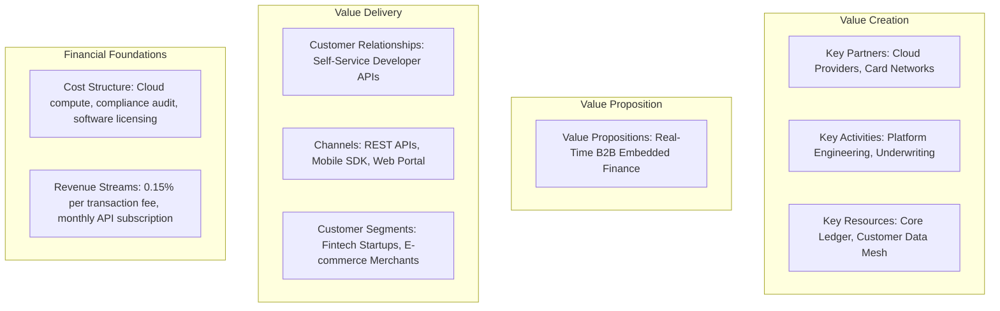

# Business Models & Canvases

How Enterprise Architects use the Business Model Canvas (BMC) to understand value creation, customer segments, cost structures, and technology dependencies.

---

## 1. The Enterprise Architecture Business Model Canvas

---

## 2. Architectural Implications of Business Model Archetypes

| Business Model Archetype | Primary Architectural Driver | Critical Technology Focus | Failure Mode to Avoid |
| :--- | :--- | :--- | :--- |
| **SaaS B2B Platform** | Multi-tenancy, zero data bleed, rapid feature release. | Tenant-isolated databases, feature flagging, automated billing meters. | Hardcoded single-tenant forks; noisy neighbor outages. |
| **Two-Sided Marketplace** | Low-latency matchmaking, real-time trust and verification. | In-memory distributed caching, WebSocket push notifications, escrow ledgers. | Database write bottlenecks during viral surges. |
| **Transaction Processing (Fintech)** | Sub-second consistency, zero data loss, strict compliance. | Distributed ACID ledgers, HSM tokenization, active-active multi-region failover. | Eventual consistency anomalies in financial balances. |
| **E-Commerce & Retail** | Extreme read scalability, high availability under flash sales. | CDN edge caching, decoupled checkout queues, event-driven inventory drops. | Monolithic database deadlocks during promotions. |
