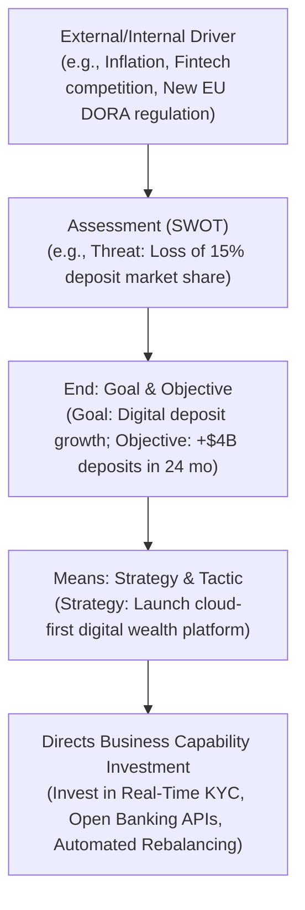

# Business Strategy & Motivation Modeling

Architecture decisions without business motivation are arbitrary. The Business Motivation Model (BMM) provides a structured metamodel connecting market drivers to technology initiatives.

---

## 1. The Business Motivation Metamodel

---

## 2. Practical Strategy Decomposition Framework

To translate an ambiguous executive strategy statement into actionable architecture:
1. **Strategic Directive**: "Become the preferred digital bank for millennials."
2. **Key Measurable Outcomes (OKRs)**:
   * Reduce mobile account opening time from 3 days to <90 seconds.
   * Achieve 99.99% mobile app availability during peak transaction windows.
   * Support instant peer-to-peer payments with zero transfer fees.
3. **Required Capability Enhancements**:
   * *Customer Identity*: Biometric facial recognition integration.
   * *Payment Processing*: FedNow / SEPA Instant credit transfer capability.
   * *Customer Analytics*: Sub-second transactional event streaming for real-time spend notifications.
4. **Architectural Directives**:
   * Deploy event-driven architecture using Kafka for account ledger updates.
   * Decommission batch overnight settlement processing in favor of real-time balance tracking.
