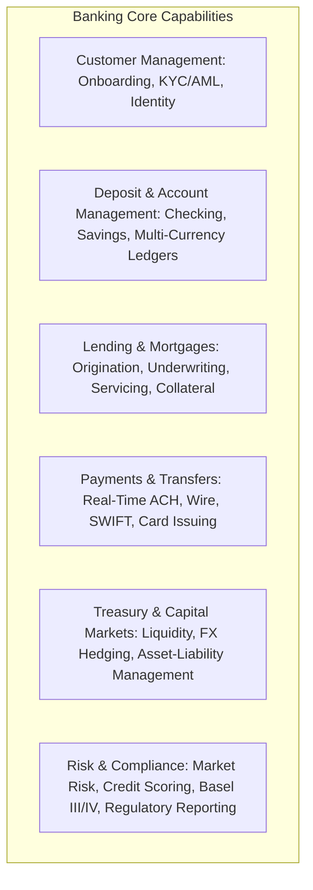

# Industry Business Architecture Models

Standard business capability blueprints across 8 core enterprise industries.

---

## 1. Banking & Capital Markets

## 2. Insurance (P&C and Life)
* **Product Management**: Actuarial Pricing, Product Catalog, Rate Filing.
* **Customer Acquisition & Agency**: Broker Management, Quoting, Policy Underwriting.
* **Policy Administration**: Policy Issuance, Endorsements, Billing, Renewals.
* **Claims Management**: First Notice of Loss (FNOL), Adjudication, Adjuster Management, Subrogation, Payout.
* **Reinsurance**: Treaty Administration, Facultative Placements, Catastrophe Risk Modeling.

## 3. Healthcare & Pharmaceuticals
* **Patient Engagement**: Patient Portal, Scheduling, Telehealth, Identity & Consent.
* **Clinical Operations**: Electronic Health Records (EHR), Clinical Decision Support, Orders & Results.
* **Revenue Cycle Management (RCM)**: Eligibility Verification, Charge Capture, Medical Coding, Claims Billing, Denial Management.
* **Pharmacy & Therapeutics**: Formulary Management, Drug Interaction Verification, Cold-Chain Distribution.
* **Clinical Trials & R&D**: Protocol Design, Patient Recruitment, EDC, FDA Electronic Submissions.

## 4. Retail & E-Commerce
* **Merchandising**: Assortment Planning, Product Information Management (PIM), Dynamic Pricing.
* **Omnichannel Commerce**: Mobile/Web Storefront, Point of Sale (POS), Clienteling, Cart & Checkout.
* **Order Management (OMS)**: Distributed Order Routing, Available-to-Promise (ATP), Returns & Exchanges.
* **Supply Chain & Logistics**: Warehouse Management (WMS), Inbound Freight, Last-Mile Delivery Tracking.
* **Customer Loyalty & Marketing**: Personalization, Loyalty Points Ledger, Campaign Automation.

## 5. Manufacturing & Industrial
* **Product Lifecycle Management (PLM)**: CAD/BOM Management, Engineering Change Orders (ECO).
* **Supply Chain Planning**: Material Requirements Planning (MRP), Demand Forecasting, Vendor Sourcing.
* **Manufacturing Operations (MES)**: Shop Floor Dispatch, SCADA/IoT Telemetry, Quality Inspection, Downtime Tracking.
* **Asset Maintenance**: Predictive Maintenance, Spare Parts Inventory, Work Order Management.

## 6. Logistics & Transportation
* **Freight Booking & Dispatch**: Rate Quoting, Carrier Selection, Load Optimization.
* **Fleet & Asset Management**: Telematics Fleet Tracking, Driver Scheduling, Fuel Management.
* **Yard & Terminal Operations**: Container Tracking, Gate Automation, Cross-Docking.
* **Customs & Trade Compliance**: Tariffs, Harmonized Codes, Customs Declaration Filings.

## 7. B2B Enterprise SaaS
* **Tenant Lifecycle Management**: Self-Service Onboarding, Tenant Provisioning, RBAC/SSO.
* **Subscription & Billing**: Usage Metering, Tiered Pricing, Invoicing, Churn Prediction.
* **Customer Success & Telemetry**: Product-Led Growth (PLG) Tracking, Health Scoring, Support Ticketing.
* **Ecosystem & Marketplace**: Developer API Gateway, Webhook Dispatcher, App Directory.

## 8. Government & Public Sector
* **Citizen Services**: Digital Citizen ID, Benefit Applications, Permit & License Issuance.
* **Revenue & Tax Administration**: Tax Assessment, Audit Case Management, Debt Collection.
* **Public Records & Justice**: Case Management, Court Filing, Vital Records Registry.
* **Procurement & Grants**: Public Tender Management, Vendor Vetting, Grant Disbursement.
