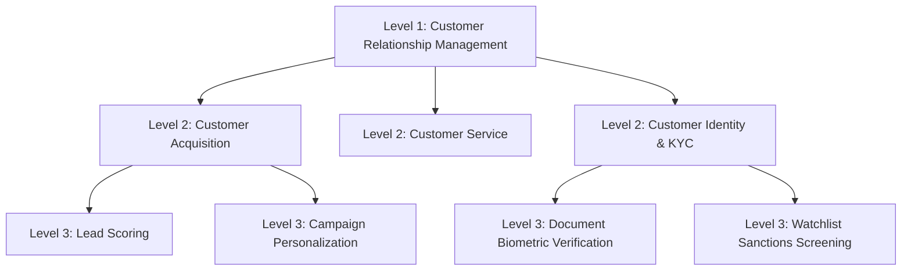

# Business Capability Architecture

Business Capability Architecture is the cornerstone of Enterprise Architecture. It establishes what an organization does to deliver value, providing a stable, technology-agnostic foundation for IT investment, application rationalization, and digital transformation.

---

## 1. The Capability Hierarchy

Capabilities are organized into a strict, mutually exclusive, collectively exhaustive (MECE) 3-tier hierarchy:

```text
Level 1: Domain Capability (Macro Category)
  └── Level 2: Core Capability (Operational Competency)
        └── Level 3: Specific Capability (Discrete Functional Ability)
```



---

## 2. Directory Contents

* **[capability-modeling-principles.md](capability-modeling-principles.md)**: Rules for identifying, scoping, and naming capabilities.
* **[capability-decomposition.md](capability-decomposition.md)**: Deep decomposition playbooks and MECE boundaries.
* **[capability-ownership-and-maturity.md](capability-ownership-and-maturity.md)**: Ownership models, RACI, and capability maturity scoring.
* **[capability-heatmaps.md](capability-heatmaps.md)**: Strategic, operational health, and investment heatmaps.
* **[capability-duplication-and-rationalization.md](capability-duplication-and-rationalization.md)**: Identifying redundant systems and consolidating platforms.
* **[capability-mapping-templates.md](capability-mapping-templates.md)**: Standard templates linking Capability $	o$ Process $	o$ Application $	o$ Data $	o$ Infrastructure.
