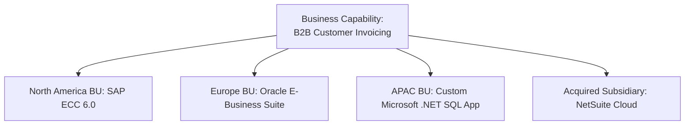

# Capability Duplication & Rationalization

How Enterprise Architects detect redundant systems across business units and execute systematic platform consolidation.

---

## 1. The Capability Duplication Phenomenon

In global enterprises, decentralized purchasing and mergers produce massive functional duplication:

* **The Problem**: 4 licensing contracts, 4 integration teams, 4 distinct customer master schemas, and zero consolidated global financial reporting.
* **The Goal**: Consolidate into a single global standard invoicing platform with localized tax/currency plugins.

---

## 2. The 4-Step Rationalization Playbook

1. **Capability-to-Application Inventory**: Map every active software asset to its primary and secondary business capabilities.
2. **Redundancy Scoring**: Identify capabilities where `Count(Applications) > 1`.
3. **Consolidation Candidate Selection**:
   * Evaluate the candidates using the **TIME Framework** (Tolerate, Invest, Migrate, Eliminate).
   * Select the platform with highest scalability, lowest TCO, and superior modern API connectivity as the target.
4. **Strangler-Fig Migration Roadmap**: Phase out legacy duplicate instances regional unit by regional unit, redirecting traffic through a central API gateway.
