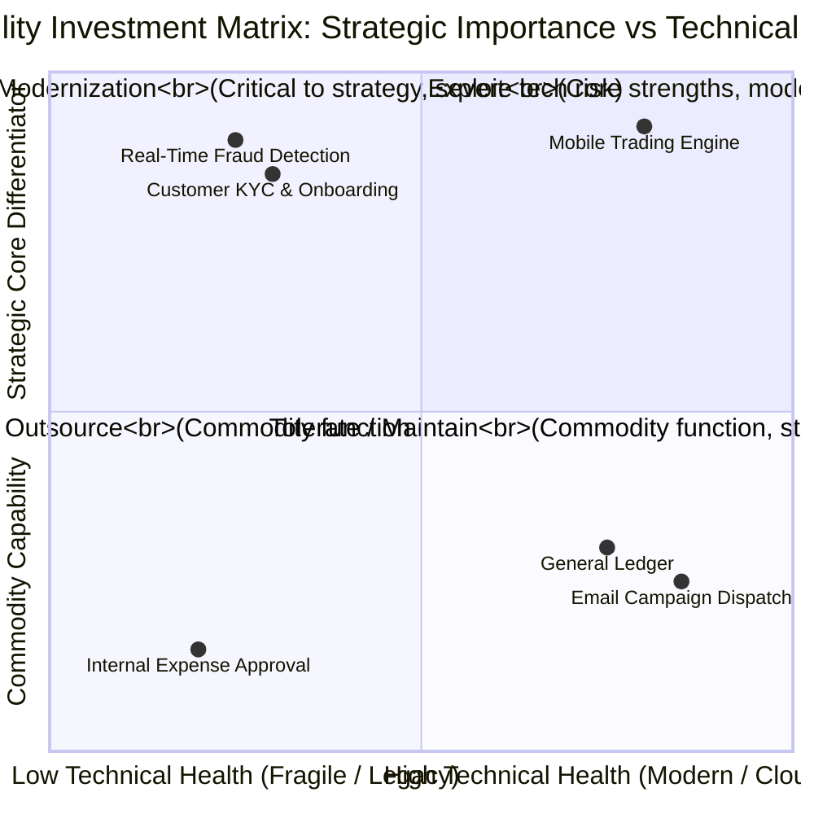

# Capability Heatmaps

Capability heatmaps are the primary visual communication tool used by Enterprise Architects to present portfolio health, strategic priorities, and investment decisions to the C-suite.

---

## 1. Types of Capability Heatmaps

---

## 2. The 3 Standard Enterprise Heatmap Overlays

1. **Strategic Investment Heatmap**:
   * *Red*: Capability marked for immediate capital investment and transformation.
   * *Yellow*: Capability marked for sustaining maintenance / minor upgrades.
   * *Gray*: Capability marked for cost containment, outsourcing, or retirement.
2. **Technical Health / Risk Heatmap**:
   * Visualizes underlying software age, CVE vulnerabilities, unsupported runtimes, and lack of DR.
3. **Capability Duplication Heatmap**:
   * Highlights capabilities supported by multiple competing applications across business units (e.g., 5 different CRM systems across 4 regions).
