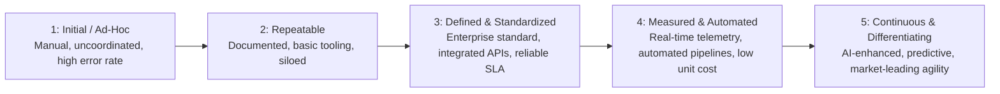

# Capability Ownership & Maturity Scoring

Capabilities cannot be managed without clear business accountability and standardized maturity assessments.

---

## 1. Capability Ownership Architecture

Every Level-1 and Level-2 business capability must have:
* **Executive Sponsor (VP/SVP level)**: Owns business outcome, capital budget allocation, and operational KPIs.
* **Lead Enterprise Architect**: Owns target architecture, technology standards, and application rationalization roadmap.
* **Lead Product / Delivery Manager**: Owns execution backlog and feature prioritization.

---

## 2. The 5-Stage Capability Maturity Scoring Scale

### Capability Assessment Scorecard Template

| Capability ID & Name | Strategic Importance | Current Maturity (1-5) | Target Maturity (1-5) | Maturity Gap | Primary Application | Annual IT Spend |
| :--- | :---: | :---: | :---: | :---: | :--- | :--- |
| **1.2.1 Identity Verification** | High | 2.0 (Semi-Manual) | 4.5 (Real-Time API) | **+2.5** | Legacy Custom Portal | $1.4M |
| **1.2.2 AML Screening** | Critical | 3.0 (Batch Rules) | 4.0 (Real-Time Graph) | **+1.0** | Fircosoft Batch Engine | $2.8M |
| **1.3.1 Contact Routing** | Medium | 3.5 (IVR Telephony) | 4.0 (Omnichannel Cloud) | **+0.5** | Genesys On-Prem | $950k |
