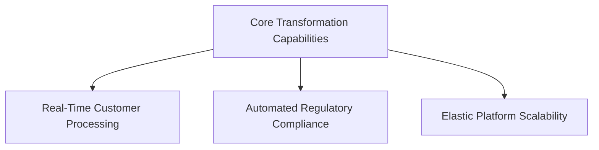
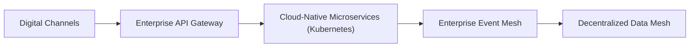

# Case Study: Enterprise Data Transformation

---

## 1. Context
A multi-billion dollar Global 2000 enterprise facing acute digital disruption, escalating technology debt, and operational scaling bottlenecks. Transitioning from an unscalable monolithic data warehouse to a decentralized Data Mesh with domain-owned data products and real-time CDC.

---

## 2. Business Problem
* Operational costs rising 25% year-over-year while digital delivery velocity was paralyzed by legacy system coupling.
* Unplanned production outages costing an estimated $8.5M annually in lost revenue and regulatory fines.
* Inability to launch competitive customer features in under 9 months.

---

## 3. Organization
* 4,500 software engineers across 18 regional business units operating without unified architectural standards.

---

## 4. Current Architecture
* Monolithic application cores tightly coupled to single on-premises database instances; batch overnight file transfers; high point-to-point integration complexity.

---

## 5. Business Capabilities

---

## 6. Constraints
* Zero downtime tolerance for Tier-1 core transactional services; hard regulatory deadline (18 months); fixed capital budget envelope.

---

## 7. Non-Functional Requirements (NFRs)
* 99.99% availability; sub-100ms API response time; zero transactional data loss (RPO=0); active-active multi-region failover.

---

## 8. Architecture Options Evaluated
* **Option 1: High-Risk Big-Bang Rewrite**: Discard legacy system and rebuild in parallel. (*Rejected due to catastrophic failure risk*).
* **Option 2: Commercial SaaS Replacement**: Replace core workflows with commercial software. (*Rejected due to lack of custom competitive features*).
* **Option 3: Phased Strangler-Fig Migration (Approved)**: Extract domains iteratively using an API gateway and real-time Kafka CDC replication.

---

## 9. Architectural Decision
Adopted **Option 3: Phased Strangler-Fig Migration**, deploying an enterprise API gateway and Kafka Debezium CDC layer to intercept traffic and synchronize data continuously.

---

## 10. Target Architecture

---

## 11. Transition Architecture
* **Plateau 1 (Months 1–6)**: Deploy API Gateway to virtualize legacy endpoints; establish real-time Kafka CDC data pipeline.
* **Plateau 2 (Months 7–14)**: Migrate 80% read traffic to cloud microservices; route writes to legacy core.
* **Plateau 3 (Months 15–18)**: Shift write mastership to cloud; deprecate legacy system.

---

## 12. Transformation Roadmap
Executed across three 6-month horizons with strict business outcome checkpoints.

---

## 13. Governance
* Architecture Review Board (ARB) audited each migration plateau; automated CI/CD fitness functions blocked legacy anti-patterns.

---

## 14. Enterprise Risks & Mitigations
* **Risk**: Dual-running data synchronization conflicts.
* **Mitigation**: Deployed automated reconciliation engines running hourly consistency checks.

---

## 15. Financial Cost & TCO
* Total Capex: $6.2M. Annual Opex savings: $4.8M/yr. Payback period: 1.3 years post-cutover.

---

## 16. Trade-offs Accepted
* Accepted temporary dual-running operational complexity in exchange for zero customer downtime during cutover.

---

## 17. Lessons Learned
1. Never attempt a big-bang rewrite of a system that has accumulated 15 years of undocumented edge-case business logic.
2. The hardest part of enterprise architecture is not technology; it is organizational alignment and data migration.

---

## 18. Alternative Decisions Rejected
* Rejecting an all-in SaaS replacement preserved the enterprise's unique algorithmic competitive advantage.

---

## 19. Related Architecture Patterns
* Strangler Fig Pattern ([15-modernization](../../15-modernization/README.md))
* Event-Driven Architecture ([01-architecture](../../01-architecture/README.md))
* [ADR-0096: Centralized vs Federated Architecture](../../16-architecture-deliverables/adr/ADR-0096-centralized-vs-federated-architecture.md)
