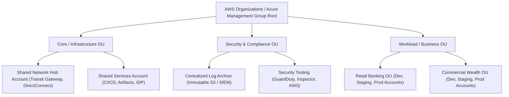

# Enterprise Cloud Strategy & Landing Zones

Enterprise cloud adoption requires a structured multi-account topology to isolate blast radiuses, enforce security guardrails, and manage billing.

---

## 1. Enterprise Multi-Account Landing Zone Topology

