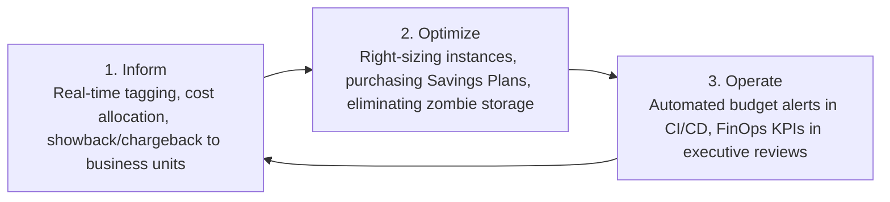

# Enterprise FinOps Governance

How Enterprise Architects collaborate with engineering and finance to govern cloud unit economics.

---

## 1. The FinOps Lifecycle: Inform, Optimize, Operate

---

## 2. Cloud Unit Economics Metric
Instead of asking "What is our monthly cloud bill?", modern architects ask:
$$\text{Cloud Cost per Transaction} = \frac{\text{Total Monthly Cloud Spend for Domain}}{\text{Total Settled Business Transactions}}$$
If the cloud bill grows by 20% while transactions grow by 80%, the architecture is scaling efficiently. If the cloud bill grows faster than business transactions, architectural re-factoring is required.
