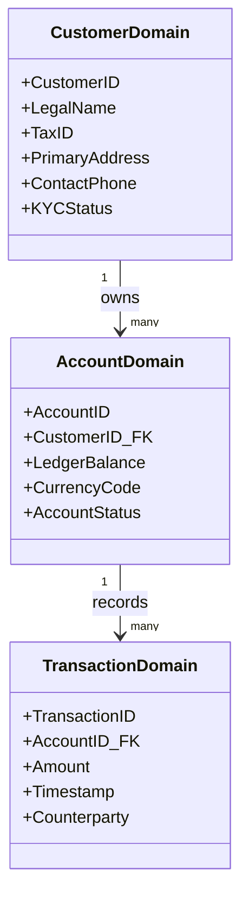

# Data Domains & Enterprise Ownership

Defining enterprise data domain boundaries and assigning strict executive stewardship.

---

## 1. The Enterprise Data Domain Hierarchy

---

## 2. Data Stewardship Responsibilities
Every core enterprise data entity must have:
* **Business Data Owner**: VP or Director who decides access rights, data definitions, and retention lifecycles.
* **Data Steward**: Operational lead responsible for resolving data quality anomalies, deduplication rules, and schema definitions.
* **Data Custodian (Technical Architect)**: Engineering owner of the database clusters, backup integrity, encryption keys, and DR failover.
