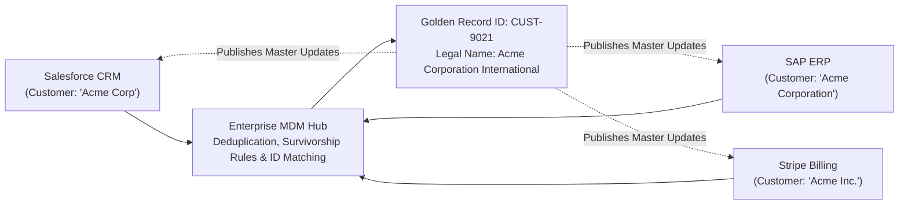

# Data Governance at Scale: MDM, Lineage, and Quality

How to govern master records and data lineage across thousands of distributed systems.

---

## 1. Master Data Management (MDM) Architecture

In large enterprises, customer records reside across CRM, billing, marketing, and ERP systems. An MDM Hub reconciles duplicates into a single **Golden Record**:

---

## 2. Automated Data Lineage
Enterprise compliance (e.g., BCBS 239, GDPR Article 30) mandates that an architect can trace any financial report number back through every ETL transformation, queue, and source table:
$$\text{Source Database} \xrightarrow{\text{CDC}} \text{Kafka Topic} \xrightarrow{\text{Flink ETL}} \text{Delta Lake} \xrightarrow{\text{dbt Model}} \text{Executive Tableau Report}$$
