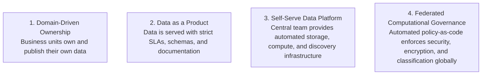

# Enterprise Data Strategy: Data Mesh & Products

Modern enterprise data architecture replaces monolithic central data warehouses with federated Data Mesh principles.

---

## 1. The 4 Principles of Enterprise Data Mesh

---

## 2. Operational vs Analytical Data Plane Separation

* **Operational Data Plane (OLTP)**: Powers day-to-day transactions (orders, payments, user logins). Highly normalized, sub-second latency, ACID guarantees.
* **Analytical Data Plane (OLAP)**: Powers BI dashboards, machine learning, and executive forecasting. Columnar, historical, aggregated across business domains.
* **The Bridge**: Change Data Capture (CDC) via Kafka streams data from the operational plane into the analytical data lakehouse without disrupting production OLTP workloads.
