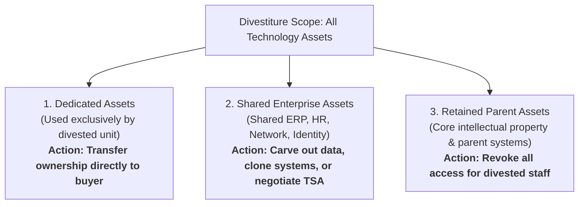

# Divestiture Separation Architecture

How Enterprise Architects plan and execute technical carve-outs without disrupting parent or divested business operations.

---

## 1. The Divestiture Asset Classification Matrix

