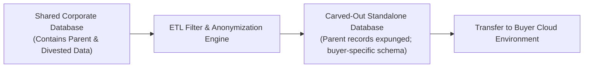

# System & Data Uncoupling Patterns

Technical execution patterns for separating tangled enterprise data, identity, and network links during a carve-out.

---

## 1. Shared Database Carve-Out Pattern

---

## 2. Identity & Access Separation Checklist
1. **Directory Clone**: Extract divested employee records from parent Entra ID / Okta into a clean, independent tenant.
2. **Network Perimeter Severing**: Terminate direct IPsec VPN and Transit Gateway connections between parent and divested offices.
3. **SaaS Seat License Transfer**: Carve out assigned software seats into separate commercial contracts with vendors.
