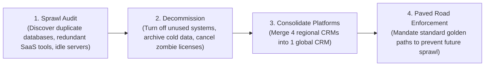

# Enterprise Simplification Playbook

Simplicity is a prerequisite for speed, reliability, and security. How Enterprise Architects proactively eliminate structural enterprise clutter.

---

## 1. The Simplification Framework: Stop, Consolidate, Standardize

---

## 2. Key Simplification Metrics
* **Total Application Count Reduction**: Target 15% reduction in active system count over 24 months.
* **SaaS Vendor Consolidation**: Reduce total software vendors by 30% through enterprise suite leveraging.
* **Point-to-Point Integration Deletion**: Replace bespoke custom batch scripts with standard event topics.
