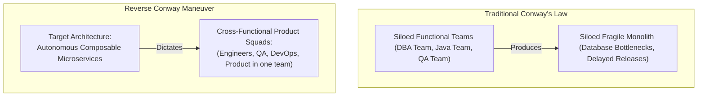

# Enterprise Architecture & Organizational Change

Architecture change is fundamentally cultural and human change. Systems reflect the communication structures of the organization that built them (**Conway's Law**).

---

## 1. The Reverse Conway Maneuver

---

## 2. The People-Process-Technology Equation
$$\text{Enterprise Transformation} = \text{Technology Change} + \text{Process Change} + \text{Operating Model Change} + \text{Cultural Adoption}$$
If you only change the technology, you merely create **an expensive, modern version of your old organizational dysfunction**.
