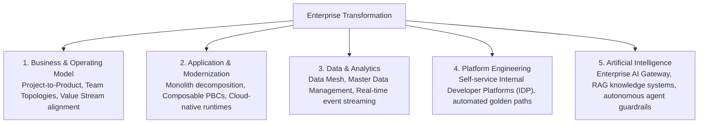

# Transformation Architecture Strategy

How Enterprise Architecture leads enterprise-wide digital and operating model transformations.

---

## 1. The 5 Pillars of Enterprise Transformation

---

## 2. Why Digital Transformations Fail
1. **Target-State Fantasy without Transition Steps**: Creating an idealized 5-year architecture diagram while ignoring the messy, political reality of current-state data debt.
2. **Big-Bang Rewrites**: Attempting to rebuild a 20-year-old core system from scratch in parallel (historically fails >80% of the time).
3. **Ignoring Conway's Law**: Changing software architecture without changing team organizational structures and incentives.
