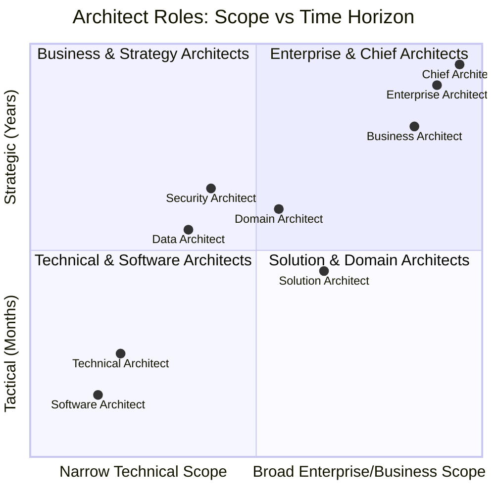

# Enterprise Architect Roles Taxonomy

In enterprise environments, the term "Architect" spans diverse scopes of responsibility, time horizons, and stakeholder interfaces.

---

## 1. The Architect Hierarchy and Spheres of Influence

---

## 2. Comparative Matrix: Role Responsibilities

| Dimension | Technical Architect (TA) | Solution Architect (SA) | Enterprise Architect (EA) | Chief Architect (CA) |
| :--- | :--- | :--- | :--- | :--- |
| **Primary Focus** | Deep technical execution, framework design, code structures. | End-to-end project solution meeting specific business requirements. | Multi-year enterprise alignment, capability evolution, portfolio rationalization. | Executive strategy, board alignment, tech vision, operating model leadership. |
| **Time Horizon** | 1–6 Months | 6–18 Months | 2–5 Years | 3–7 Years |
| **Primary Stakeholders** | Engineers, Tech Leads, DevOps. | Product Managers, Project Managers, Engineering Leads. | Business Unit Leaders, VPs of Engineering, CIO/CTO, CISO. | CEO, Board of Directors, CIO, CTO, CFO, Business Presidents. |
| **Key Deliverables** | Component designs, framework specs, PR reviews, benchmark tests. | Solution Architecture Document (SAD), C4 models, API specs, cloud topology. | Capability maps, transition architectures, technology standards, TIME portfolio matrices. | Enterprise technology strategy, capital allocation models, M&A tech due diligence. |
| **Governance Scope** | Code quality, static analysis, unit/integration test coverage. | Solution conformance, ADR creation, project-level security/scalability. | Architecture Review Board (ARB) chair, tech debt register, exception approvals. | Enterprise risk posture, multi-million dollar vendor contracts, organizational design. |

---

## 3. Specialized Domain Architect Roles

* **Business Architect**: Models business capabilities, value streams, customer journeys, and operating models. Ensures tech projects map directly to business strategy.
* **Data Architect**: Designs enterprise data models, data governance, master data management (MDM), data mesh topologies, and analytical platforms (cross-link [06-data](../../06-data/README.md)).
* **Application Architect**: Establishes enterprise software engineering standards, framework lifecycles, and microservice/modular monolith patterns (cross-link [01-architecture](../../01-architecture/README.md)).
* **Security Architect**: Establishes Zero Trust frameworks, identity federations, threat modeling, and regulatory compliance standards (cross-link [10-security](../../10-security/README.md)).
* **Infrastructure / Cloud Architect**: Architects global networks, Kubernetes clusters, hybrid cloud landing zones, and FinOps governance (cross-link [08-cloud](../../08-cloud/README.md)).
* **Domain Architect**: Owns architecture for an entire business vertical (e.g., Retail Banking, Global Supply Chain, Claims Processing), coordinating multiple Solution Architects.
