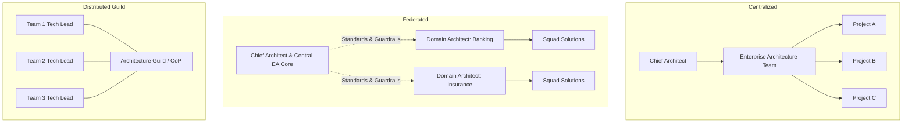

# Enterprise Architecture Organization Structures

How an enterprise structures its architecture practice determines whether EA becomes an accelerating enabler or a bureaucratic impediment.

---

## 1. Organizational Models

### 1. Centralized Architecture Team
* **Structure**: All Enterprise and Solution Architects report into a central Enterprise Architecture Office headed by the Chief Architect or VP of Architecture.
* **Pros**: Strong consistency, tight standard enforcement, easy portfolio-wide visibility, unified capital allocation.
* **Cons**: Bottleneck risk, perceived "ivory tower" isolation, disconnect from daily engineering realities, delayed delivery.
* **When to Use**: Heavily regulated organizations undergoing acute remediation, or companies under 5,000 employees with low architectural maturity.

### 2. Federated Architecture (Hub-and-Spoke — Industry Best Practice)
* **Structure**: A small central EA core defines enterprise standards, platforms, and governance, while Domain and Solution Architects report into business units or product lines with a dotted line to the Chief Architect.
* **Pros**: Strong business proximity, rapid domain execution, high architect empathy with delivery teams, preserved enterprise coherence.
* **Cons**: Requires mature leadership to prevent domain architects from going rogue and accumulating localized technical debt.
* **When to Use**: Large multi-national enterprises, diversified business units, organizations with over 50 product squads.

### 3. Distributed / Community of Practice (CoP)
* **Structure**: No dedicated enterprise architects; architecture decisions are made democratically by engineering leads across an Architecture Guild.
* **Pros**: Maximum developer buy-in, zero ivory tower friction, rapid localized iteration.
* **Cons**: Total fragmentation, duplicate capability purchasing, incompatible data schemas, zero enterprise-wide roadmap.
* **When to Use**: Early-stage hyper-growth scale-ups (<500 engineers) before reaching enterprise complexity.

---

## 2. Scaling Architecture Across Enterprise Dimensions

| Enterprise Stage | Engineering Headcount | Recommended Architecture Structure | Primary Focus of EA |
| :--- | :--- | :--- | :--- |
| **Startup / Scaleup** | 50 – 250 | Distributed Guild + 1-2 Principal Architects | Technology selection, basic scaling, avoiding fatal monolith bottlenecks. |
| **Mid-Enterprise** | 250 – 1,000 | Centralized Architecture Office (3–6 Architects) | Technology standardization, core platform engineering, security/data baselines. |
| **Global Enterprise** | 1,000 – 10,000+ | Federated Model (Central Core + Embedded Domain SAs) | Capability rationalization, M&A integration, global platforms, regulatory compliance. |
| **Global Conglomerate** | 10,000+ | Multi-Tier Federated (Group EA + Subsidiary EAs + Domain SAs) | Capital allocation, cross-subsidiary API integration, corporate risk, FinOps at scale. |
