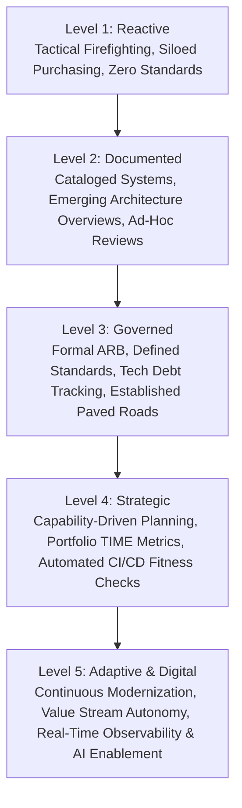

# Enterprise Architecture Maturity Model

A quantitative framework to evaluate an enterprise's architectural capability, governance discipline, and strategic impact across 5 progressive levels.

---

## 1. The 5 Levels of Enterprise Architecture Maturity

---

## 2. Detailed Dimension Evaluation Rubric

| Maturity Dimension | Level 1: Reactive | Level 2: Documented | Level 3: Governed | Level 4: Strategic | Level 5: Adaptive |
| :--- | :--- | :--- | :--- | :--- | :--- |
| **Business Alignment** | Technology decisions driven solely by urgent local project demands. | IT projects mapped to high-level departmental goals. | Business capabilities defined; IT spend tracked against capability map. | EA co-creates business strategy; participates in capital budgeting. | Architecture dynamically reallocates platforms based on real-time market signals. |
| **Governance & ARB** | No review process; teams build or buy software autonomously. | Periodic ad-hoc architecture reviews after solutions are built. | Formal ARB gates major projects; documented exception lifecycle. | Automated compliance checks in CI/CD; ARB focuses only on major risks. | Self-governing systems; policy-as-code; continuous automated compliance audits. |
| **Application Portfolio** | No accurate application inventory; widespread shadow IT. | Spreadsheet catalog of systems with incomplete ownership data. | Formal APM system (e.g., LeanIX); health, cost, and criticality tracked. | Systematic TIME model rationalization driving active retirement pipelines. | Composable API/PBC ecosystem; continuous automated dependency discovery. |
| **Technology Standards** | Unbounded technology sprawl (e.g., 14 logging frameworks, 8 DB types). | Published list of recommended technologies with minimal enforcement. | Tiered technology radar (Strategic, Standard, Tolerated, Retire). | Paved roads / Internal Developer Platforms enforce standards by default. | Automated architectural fitness functions block deprecated runtimes in CI. |
| **Data & Integration** | Direct point-to-point database coupling; ungoverned file transfers. | Documented data dictionaries; emerging REST API guidelines. | Enterprise data domains, MDM for core entities, centralized API gateway. | Data Mesh with product ownership; event-driven integration standard. | Automated schema evolution, real-time data lineage, cross-cloud zero data bleed. |
| **Cloud & Platforms** | Uncoordinated cloud accounts; unpredictable cloud bills. | Basic cloud migration (Lift & Shift); shared VPCs. | Enterprise Cloud Landing Zones, multi-account hierarchy, FinOps basics. | Internal Developer Platform (IDP) providing self-service compliant infra. | Multi-region autonomous platform with dynamic workload orchestration and FinOps unit cost. |
| **AI Architecture** | Unsanctioned consumer LLM usage; isolated ML experiments. | Centralized OpenAI API key; ad-hoc sandbox environments. | Enterprise AI Gateway, prompt injection guardrails, EU AI Act categorization. | Standard RAG & Agentic capability platforms; LLM-as-a-judge CI testing. | Composable enterprise AI capabilities seamlessly integrated into core value streams. |

---

## 3. Maturity Assessment Methodology

To conduct an architectural maturity audit:
1. **Evidence Collection**: Review recent architecture deliverables, ARB minutes, APM inventory, CI/CD pipeline configs, and cloud billing reports.
2. **Stakeholder Interviews**: Interview CIO/CTO, Lead Architects, Engineering Managers, Product VPs, and Security Officers.
3. **Scorecard Tabulation**: Rate each of the 7 dimensions on a 1.0 – 5.0 scale.
4. **Gap Analysis & Roadmap**: Define initiatives required to advance the organization to the target maturity state over 12–24 months.
