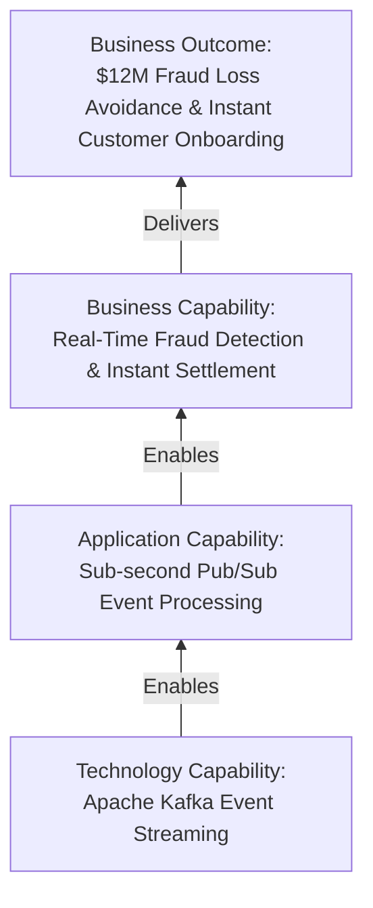

# The Enterprise Architecture Mental Model

The fundamental conceptual model connecting corporate strategy to operational software delivery.

---

## 1. The Strategy-to-Execution Hierarchy

```text
                    BUSINESS STRATEGY
                    "Expand into European digital wealth management"
                           │
                           ▼
                    BUSINESS OUTCOMES
                    "Acquire 500k customers at <$50 CAC, comply with GDPR/MiFID II"
                           │
                           ▼
                    VALUE STREAMS
                    "Customer Acquisition -> Identity Verification -> Portfolio Funding"
                           │
                           ▼
                   BUSINESS CAPABILITIES
                    "KYC Compliance", "Automated Portfolio Rebalancing", "Real-Time Payments"
                           │
              ┌────────────┼────────────┐
              ▼            ▼            ▼
          APPLICATION     DATA       TECHNOLOGY
         Microservices  Customer MDM  Kubernetes, AWS
         Order Engine   Audit Ledger  Kafka, PostgreSQL
              │            │            │
              └────────────┼────────────┘
                           ▼
                     ARCHITECTURE
              "Target Blueprints, Transition States, Boundary Contracts"
                           │
                           ▼
                    TRANSFORMATION
              "Initiative Sizing, Roadmap Sequencing, Investment Slices"
                           │
                           ▼
                    GOVERNANCE
              "ARB Reviews, Design Guardrails, Architecture Exceptions"
                           │
                           ▼
                     MEASUREMENT
              "Fitness Functions, SLA/SLO Audits, TCO & Unit Cost Metrics"
                           │
                           ▼
                    CONTINUOUS CHANGE
              "Evolutionary Feedback Loop into Strategic Planning"
```

---

## 2. Reverse Traceability: From Technology to Business Value

Enterprise architects must be equally fluent in reverse reasoning. When an engineering team requests an investment (e.g., "We need to adopt Apache Kafka and migrate to event-driven architecture"), the EA must translate technology capability into business impact:



If an architectural decision cannot be traced to an enabled business capability and outcome, it is **technology tourism**, not Enterprise Architecture.
