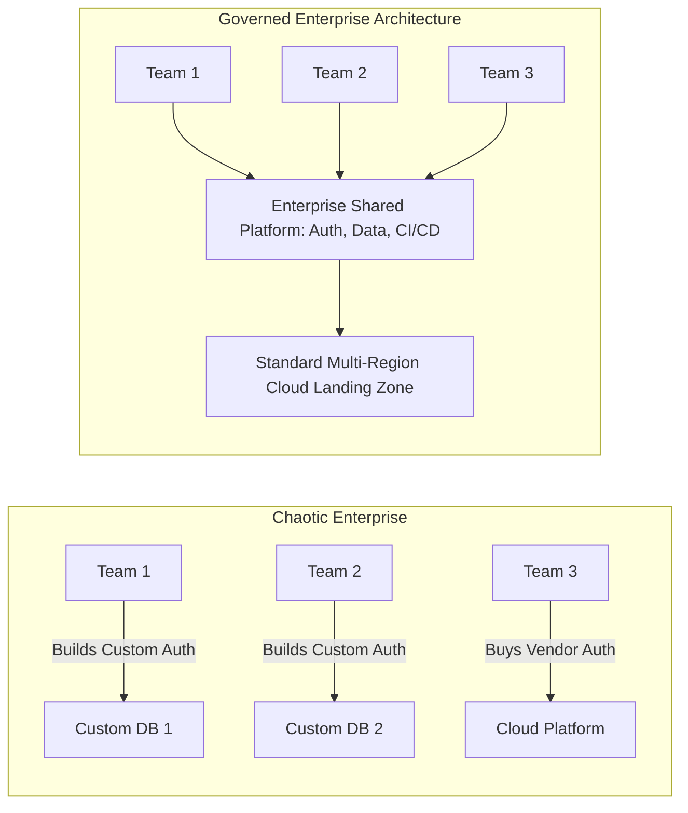

# What Enterprise Architecture Is (and Is Not)

Enterprise Architecture (EA) is the strategic discipline of proactively and holistically leading enterprise responses to disruptive forces by identifying and analyzing the execution of change toward desired business vision and outcomes.

---

## 1. The Core Purpose of Enterprise Architecture

In large, complex organizations (Global 2000, Fortune 500, government entities), technology sprawl, organizational silos, and short-term tactical optimization create crippling fragmentation. Enterprise Architecture exists to:

1. **Align Capital Investment with Strategic Intent**: Ensure IT capital and operational expenditures directly advance corporate strategy rather than departmental fiefdoms.
2. **Eliminate Redundant Capabilities**: Identify overlapping software, data stores, and platforms across business units to consolidate spend.
3. **Manage Enterprise Risk and Debt**: Ensure security, regulatory compliance, data privacy, and technological obsolescence are systematically tracked and remediated.
4. **Accelerate Time-to-Market**: Provide reusable platforms, standard data models, approved integration patterns, and "paved roads" so product teams build value instead of reinventing foundational plumbing.

---

## 2. What Enterprise Architecture Is NOT

| Misconception | Reality of Modern Enterprise Architecture |
| :--- | :--- |
| **An Ivory Tower of Diagram Creators** | Modern EA is embedded in delivery, validating fitness functions via CI/CD and shaping multi-year transformation roadmaps. |
| **A Bureaucratic Bottleneck** | EA establishes guardrails, golden paths, and self-service standards that enable product teams to move faster safely. |
| **Strict Adherence to TOGAF/ArchiMate** | Frameworks are communication tools and conceptual checklists, not dogmatic religions. Real EA prioritizes pragmatic business decisions. |
| **Detailed Software Engineering** | EA defines domain boundaries, capability mappings, interfaces, and technology standards; Solution and Software Architects design the internal component code. |
| **IT-Only Technical Strategy** | 50% of EA is Business Architecture: understanding revenue models, cost drivers, customer journeys, and operating model constraints. |

---

## 3. The 15 Mandatory Inquiries for Every Enterprise Architecture Decision

When evaluating an enterprise-level change, the Enterprise Architect must answer:
1. **What problem does this solve?**: What concrete business friction or strategic gap is being addressed?
2. **Why does the organization need it?**: Can existing capabilities or applications solve this with incremental modification?
3. **When should it be used?**: Explicit boundaries and criteria for deployment.
4. **When should it NOT be used?**: Concrete disqualifiers and negative triggers.
5. **What inputs are required?**: Strategic drivers, capability assessments, budget envelope, compliance constraints.
6. **What outputs/artifacts are produced?**: Target architecture, transition plateaus, capability delta maps, ADRs.
7. **Who consumes the output?**: C-suite, portfolio managers, delivery squads, procurement, security officers.
8. **How does it influence decisions?**: Capital prioritization, vendor selection, project go/no-go gates.
9. **What are the trade-offs?**: Speed vs technical debt; standard vendor lock-in vs bespoke engineering complexity.
10. **What are the common failure modes?**: Executive misalignment, underestimating data migration, culture friction.
11. **Connection to Business Strategy**: Directly linked to revenue expansion, cost optimization, or risk mitigation.
12. **Connection to Solution Architecture**: Translates macro enterprise standards into actionable implementation blueprints.
13. **Connection to Portfolio Management**: Guides the TIME (Tolerate, Invest, Migrate, Eliminate) categorization of assets.
14. **Connection to Governance**: Enforced via Architecture Review Boards, automated fitness checks, and waiver tracking.
15. **Evolutionary Trajectory**: How this architecture adapts when organizational scale, regulations, or technology shifts.
