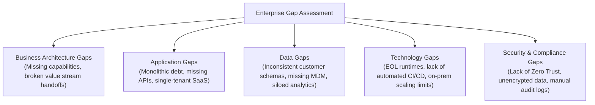

# Architecture Gap Analysis Framework

How to systematically uncover functional and non-functional deficits between Current and Target states.

---

## 1. Multi-Domain Gap Analysis Scope

```mermaid
graph TD
    Assessment["Enterprise Gap Assessment"] --> BA["Business Architecture Gaps<br/>(Missing capabilities, broken value stream handoffs)"]
    Assessment --> AA["Application Gaps<br/>(Monolithic debt, missing APIs, single-tenant SaaS)"]
    Assessment --> DA["Data Gaps<br/>(Inconsistent customer schemas, missing MDM, siloed analytics)"]
    Assessment --> TA["Technology Gaps<br/>(EOL runtimes, lack of automated CI/CD, on-prem scaling limits)"]
    Assessment --> SA["Security & Compliance Gaps<br/>(Lack of Zero Trust, unencrypted data, manual audit logs)"]
```
