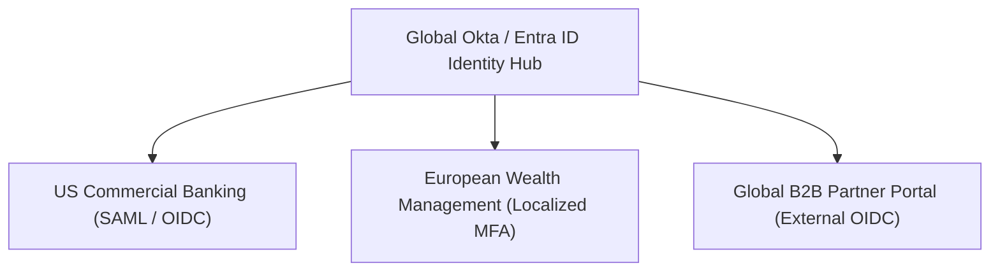

# Global Identity & Integration Architecture

Managing federated enterprise identity and high-latency cross-border networking across global enterprises.

---

## 1. Global Identity Federation

---

## 2. Cross-Border Latency & Network Optimization
* **Speed of Light Constraint**: Round-trip latency between London and Singapore is ~170ms; systems must **never** make synchronous cross-continent HTTP calls in customer checkout loops.
* **Edge Routing**: Terminate TLS at regional CloudFront/Akamai edge nodes; cache read-heavy catalog data regionally; route only write transactions over dedicated AWS DirectConnect backbones.
