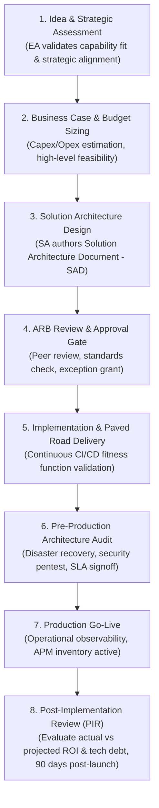

# Architecture Lifecycle: Idea to Post-Implementation Review

The formal governance stages an enterprise initiative traverses from initial conception to production retirement.

---

## 1. The 8 Stages of the Architecture Lifecycle

