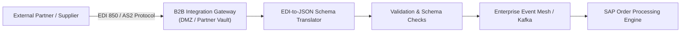

# Legacy & B2B Integration Architecture

Integrating with external supply chain partners, banking networks, and legacy mainframe systems.

---

## 1. B2B / EDI Integration Architecture

---

## 2. Mainframe Encapsulation Patterns
* **Anti-Corruption Layer (ACL)**: Sits between modern microservices and legacy COBOL systems to translate modern domain entities into legacy fixed-width copybooks.
* **Change Data Capture (CDC)**: Reads mainframe transaction logs in real-time, streaming balance changes to cloud caches without impacting mainframe MIPS CPU budgets.
