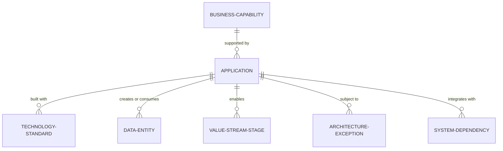

# Architecture Catalog Taxonomy

The metadata schema and taxonomy required to organize an enterprise architecture repository into a queryable, structured knowledge graph.

---

## 1. Core Architecture Entities and Relationships



---

## 2. Standard Metadata Schema for Systems

Every application in the enterprise catalog must define:
```yaml
id: app-payment-router-01
name: Global Payment Router
domain: Financial Services
owner:
  business_unit: Digital Banking
  technical_lead: jane.doe@enterprise.com
criticality: Tier-1 (Mission Critical)
lifecycle_status: Invest
business_capabilities:
  - cap-payment-processing
  - cap-fraud-detection
technologies:
  runtime: Java 21 / Spring Boot 3
  database: PostgreSQL 16
  messaging: Apache Kafka
data_classification: Confidential (PCI-DSS)
hosting: AWS multi-region (eu-west-1, us-east-1)
tco_annual_usd: 480000
```
