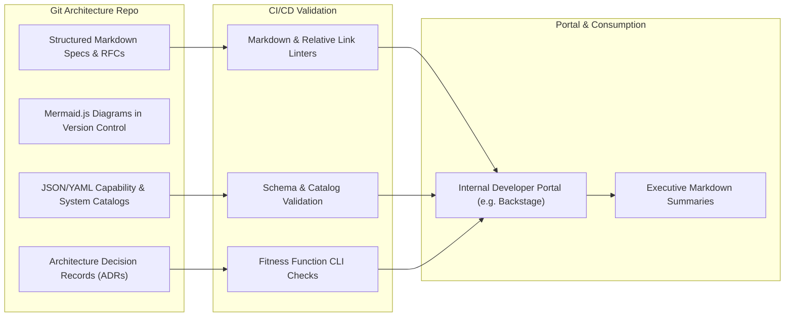

# Architecture Knowledge Management: The Git-Based Repository

Treating Enterprise Architecture as Code: why modern enterprise architecture repositories must live in Git alongside developer workflows rather than decaying inside proprietary modeling silos.

---

## 1. The Architecture as Code (AaC) Model

Historical EA tools (e.g., heavyweight legacy modeling repositories) failed because they created a walled garden inaccessible to software engineers. Modern EA uses a **Git-based Living Architecture Repository**:

---

## 2. Core Repository Structure Standards

1. **Text-Based Version Control**: All capability definitions, principles, standards, and blueprints are authored in GitHub Flavored Markdown.
2. **Native Embedded Diagrams**: System sequence, component, and entity relationship diagrams are written in text using Mermaid.js, ensuring diagrams are diffable in git commits.
3. **Immutable Decision History**: Architecture Decision Records (ADRs) provide a chronological, immutable ledger explaining why decisions were made, what alternatives were rejected, and what trade-offs were accepted.
4. **Living Portals**: Git repositories feed directly into internal developer portals (e.g., Backstage, MkDocs, Docusaurus) providing searchable, role-based navigation for engineers and executives alike.
