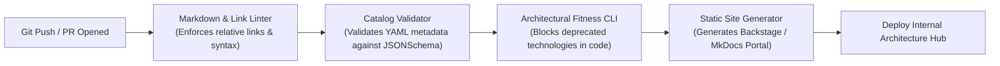

# Living Documentation in Git: Automating Architecture Verification

How to transform markdown-based enterprise architecture specifications into verifiable, automated living documentation using CI/CD pipelines.

---

## 1. The Continuous Architecture Verification Pipeline

---

## 2. Automated Architecture Quality Checks

1. **Dead Link Prevention**: Automated linters verify that all relative markdown links between strategy, capabilities, applications, and ADRs resolve cleanly.
2. **Schema Conformance**: Every system, capability, and technology standard YAML definition is validated against formal JSONSchemas during pull request review.
3. **Automated Deprecation Alerts**: Scripts inspect microservice dependency manifests (`package.json`, `pom.xml`, `.csproj`) in application repositories and flag usages of technologies listed as "Retire" in the enterprise Technology Radar.
