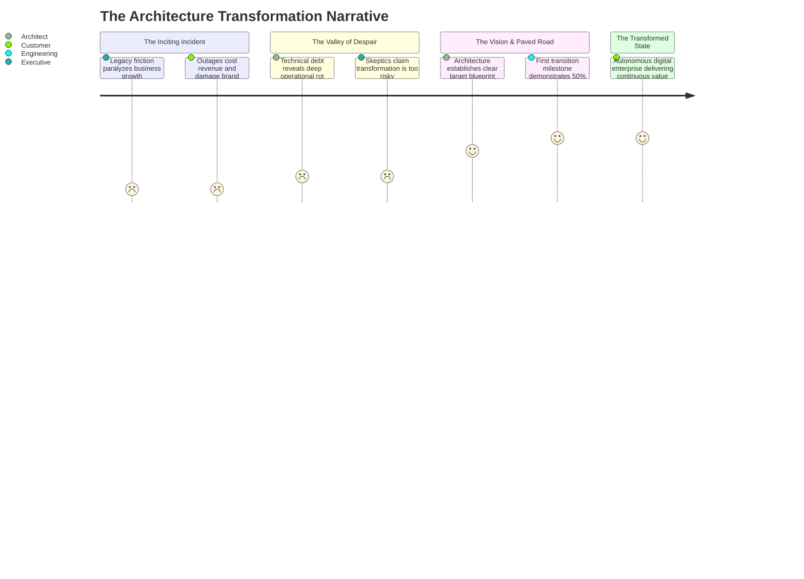

# Architecture Storytelling: The Transformation Narrative

Architecture storytelling is the discipline of framing complex technical modernizations into compelling business transformation narratives that inspire executive backing and engineering commitment.

---

## 1. The Classic Transformation Narrative Arc

---

## 2. The 4-Part Executive Narrative Framework

1. **The Current Reality & Hidden Cost**: Define the current state in terms of business liability (e.g., "Our 18-year-old core banking system incurs $24M in annual maintenance, limits new product launches to 14-month cycles, and exposes the firm to critical compliance sanctions").
2. **The Catalyzing Crisis**: Highlight what happens if the enterprise does nothing (market share loss, catastrophic failure, regulatory fines).
3. **The Target Vision & Paved Path**: Present the target architecture not as an abstract diagram, but as an enabler of business agility (e.g., "A modern composable core enabling 1-week product launches and real-time fraud prevention").
4. **The Low-Risk Transition Steps**: Reassure executives by demonstrating iterative value through strangler-fig migration phases rather than a high-risk "big bang" rewrite.
