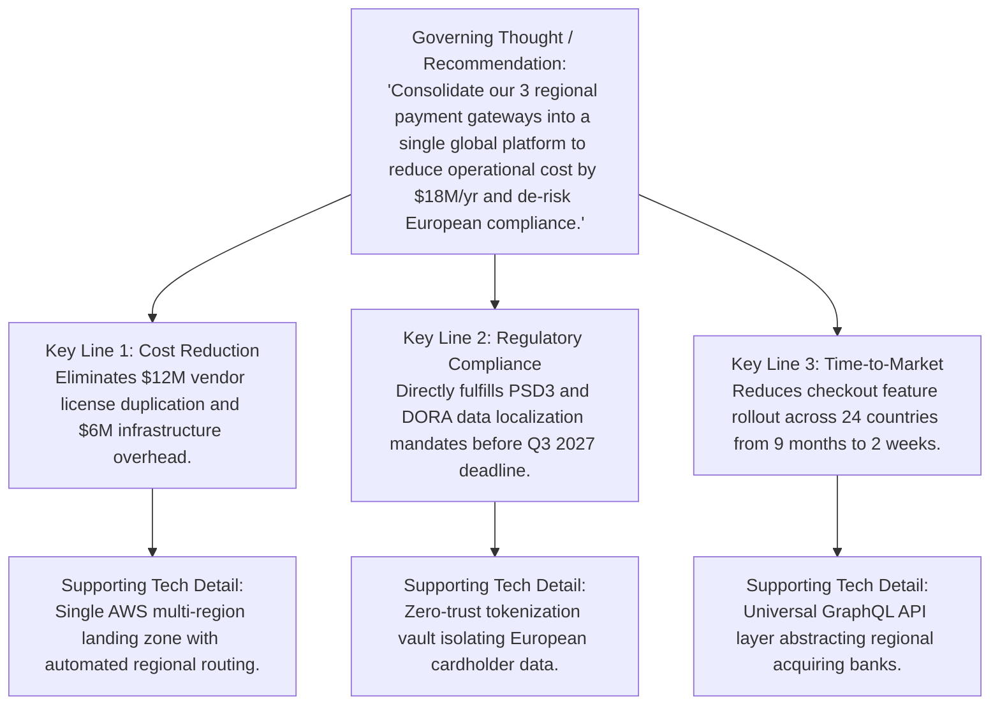

# Architecture Leadership: Executive Communication & Storytelling

Enterprise architects succeed or fail based on their ability to communicate complex technological trade-offs in terms that resonate with the C-suite and board members.

---

## 1. The Pyramid Principle for Architecture Storytelling

Never present technical architecture chronologically or bottom-up to executives. Use the **Minto Pyramid Principle**:

---

## 2. Rules for Communicating with the C-Suite

1. **Lead with Business Impact, Not Architecture Styles**:
   * *Bad*: "We need to re-architect our legacy monolith into event-driven microservices using Kafka."
   * *Good*: "Our current customer onboarding system crashes under peak campaigns, losing an estimated $2.4M in revenue each quarter. An event-based architecture will scale to 10x peak volume while cutting checkout latency by 65%."
2. **Quantify Risk in Monetary Terms**:
   * *Bad*: "Our Oracle database version is unsupported and represents architectural debt."
   * *Good*: "Running on an unpatched database engine leaves our payment processing infrastructure exposed to known CVEs, creating an estimated $45M regulatory fine liability and a 48-hour recovery window in a disaster scenario."
3. **Present Decisions as Trade-Off Options, Never Monolithic Ultimatums**:
   * Always provide 3 viable options:
     * **Option A (Aggressive Modernization)**: High capital ($10M), 18 months, highest ROI, lowest long-term operational risk.
     * **Option B (Phased Modernization — Recommended)**: Moderate capital ($4M), 24 months, balances speed and risk.
     * **Option C (Tactical Containment / Do Minimum)**: Low capital ($800k), 6 months, defers technical debt, carries high operational overhead.
