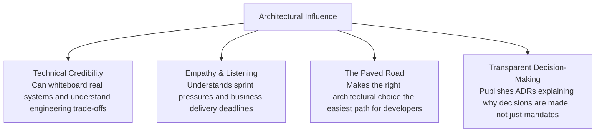

# Architecture Leadership: Influence Without Authority

In federated and decentralized organizations, Enterprise Architects rarely have direct line management over software engineers. Effective architects lead through influence, empathy, and technical credibility.

---

## 1. The 4 Pillars of Architectural Influence

---

## 2. Key Tactics for Influencing Product Teams

1. **Build Paved Roads, Not Roadblocks**: If you want teams to adopt a standard (e.g., OpenTelemetry tracing or OAuth2 authentication), provide production-ready starter templates, CI/CD plugins, and client libraries that reduce their engineering effort by 80%.
2. **Co-Design with Engineering Leads**: Never draft architectural standards in isolation. Form working groups with respected principal engineers to co-create the standard before presenting it to the ARB.
3. **Praise Alignment Publicly; Coach Misalignment Privately**: Highlight teams that exemplify modern architecture principles in all-hands and architectural guild showcases.
