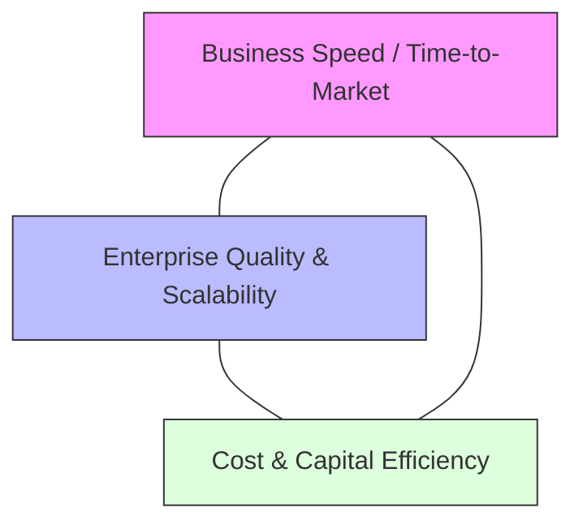

# Architecture Leadership: Trade-Off Negotiation

Enterprise architecture is the art of navigating competing non-functional requirements and organizational trade-offs.

---

## 1. The Core Enterprise Architecture Trilemma

---

## 2. Structured Trade-Off Resolution Process

When stakeholders clash (e.g., Product Manager demands immediate tactical delivery vs Enterprise Architect demanding architectural standards conformance):

1. **Acknowledge the Validity of Both Perspectives**: Validate the product urgency before defending architectural standards.
2. **Expose the True Hidden Cost**: Calculate the downstream technical debt cost of a short-term tactical shortcut (e.g., "Skipping multi-tenant isolation gets us to market 6 weeks earlier, but refactoring it later will cost $1.8M and halt feature development for 4 months").
3. **Offer a Time-Bound Compromise (Architectural Debt Contract)**:
   * Allow the tactical shortcut under a formal **Architecture Exception**.
   * Require an explicit, funded backlog item in Sprint N+2 to refactor the solution into the target architectural standard.
   * Set an automatic expiration date on the exception waiver.
