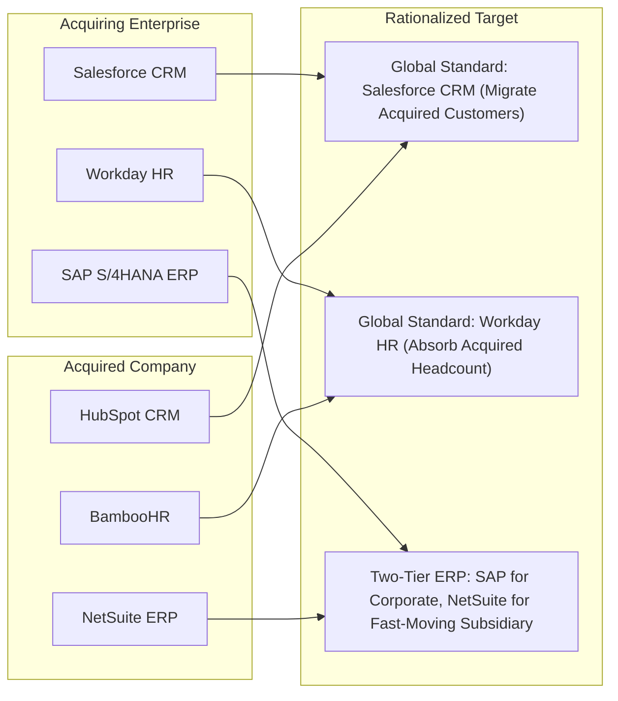

# M&A Application & Data Overlap Rationalization

How to eliminate duplicate software licenses and consolidate fragmented customer databases post-acquisition.

---

## 1. Post-Acquisition System Overlap Matrix

