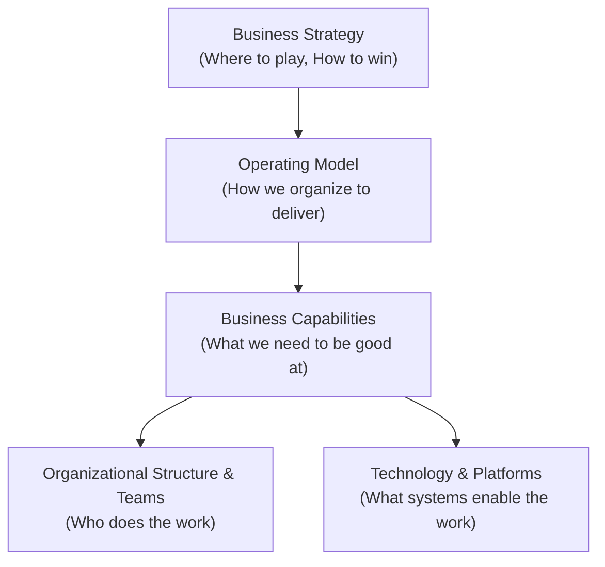

# Business & IT Operating Model Architecture

An operating model defines how an organization configures its people, processes, governance, and technology to deliver value to customers and stakeholders.

---

## 1. The Strategy-to-Operating-Model Hierarchy

---

## 2. Core Operating Model Archetypes

### 1. Project-Centric IT (Legacy)
* **Structure**: Temporary project teams formed to deliver specific software releases, dissolving post-launch into maintenance ("run") teams.
* **Architectural Implication**: High architectural fragmentation, unbounded technical debt, zero long-term system ownership.

### 2. Product-Centric Operating Model (Modern Digital)
* **Structure**: Long-lived, cross-functional squads aligned to specific customer journeys or business capabilities (e.g., "Checkout Squad", "KYC Squad").
* **Architectural Implication**: High domain knowledge, continuous evolutionary architecture, clear accountability for technical debt.

### 3. Platform-Centric Operating Model (Enterprise Scale)
* **Structure**: Cross-functional product squads consume self-service capabilities (compute, CI/CD, data storage, AI gateway) provided by internal Platform Teams.
* **Architectural Implication**: Minimizes cognitive load on product teams; accelerates development velocity while enforcing enterprise security and governance by default.
