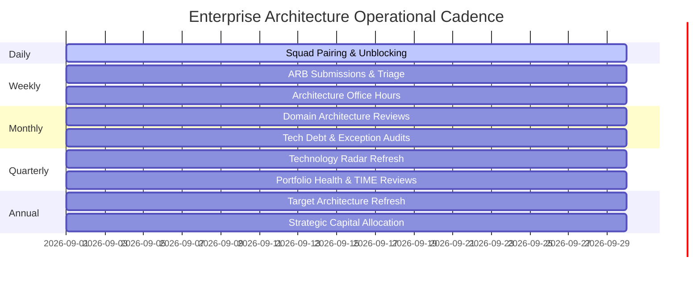

# Enterprise Architecture Operating Cadence

Enterprise Architecture fails when treated as an annual planning exercise. Modern EA operates as a rhythmic, continuous discipline embedded across daily, weekly, monthly, quarterly, and annual operational cycles.

---

## 1. The Multi-Tier Operating Cadence

---

## 2. Detailed Cadence Specifications

### 1. Daily Cadence (Tactical Alignment)
* **Design Consultations**: 30-minute office-hour drop-ins for solution architects and tech leads evaluating design trade-offs.
* **Critical Incident Review**: Monitoring major production outages to identify systemic architectural flaws or missing resilience patterns.

### 2. Weekly Cadence (Governance & Enablement)
* **Architecture Review Board (ARB)**: 90-minute structured session reviewing major solution designs, evaluating new technology requests, and adjudicating exception requests.
* **Architecture Guild Standup**: 45-minute sync between central EA and domain architects to discuss cross-cutting dependencies and platform releases.

### 3. Monthly Cadence (Domain Health & Debt Tracking)
* **Technical Debt Review**: Inspecting enterprise debt registries, tracking remediation progress, and escalating critical end-of-life (EOL) assets.
* **Exception Expiration Audit**: Reviewing temporary architectural waivers approaching expiration; deciding whether to renew, remediate, or revoke.

### 4. Quarterly Cadence (Strategic Review)
* **Technology Radar Refresh**: Publishing the updated quarterly Technology Radar (Adopt, Trial, Assess, Hold) based on production learnings.
* **Application Portfolio Health Review**: Updating application criticality, health, and risk scores in the APM tool.
* **Quarterly Planning (PI Planning / OKR Alignment)**: Validating that engineering roadmaps align with enterprise transition architectures.

### 5. Annual Cadence (Corporate Strategy)
* **Enterprise Target Architecture Update**: Refreshing the 3–5 year architectural vision to incorporate disruptive market shifts (e.g., generative AI, sovereign cloud).
* **Capital Budgeting Advisory**: Collaborating with CIO and CFO to prioritize multi-million dollar technology investments for the fiscal year.
