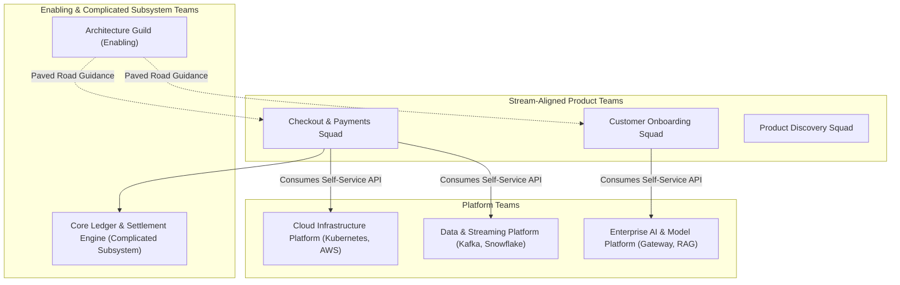

# Product vs Platform Operating Model

How modern enterprises structure Team Topologies to separate customer value delivery from foundational platform engineering.

---

## 1. Team Topologies Architecture

---

## 2. Architectural Responsibilities by Team Type

1. **Stream-Aligned (Product) Teams**:
   * Responsible for end-to-end customer value within a specific business capability.
   * Focus on business logic, UI/UX, domain workflows, and customer analytics.
2. **Platform Teams**:
   * Treat the internal platform as a product; consumers are internal software engineers.
   * Provide self-service, compliant, observable APIs for infrastructure, databases, CI/CD, and AI.
3. **Enabling Teams (Architecture)**:
   * Research emerging technologies, design paved roads, and coach stream-aligned squads through architectural transitions.
