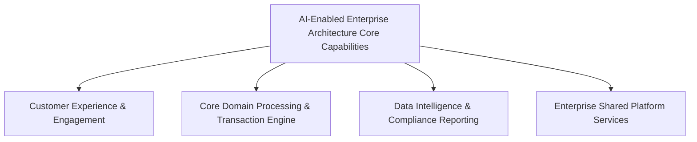

# Enterprise Reference Architecture: AI-Enabled Enterprise Architecture

---

## 1. Business Context
An enterprise-grade reference blueprint designed for Global 2000 and Fortune 500 enterprises. Enterprise AI platform featuring central AI Gateways, enterprise RAG knowledge engines, and governed agentic workflows.

---

## 2. Business Drivers
* **Revenue Acceleration**: Rapid time-to-market for digital products across regional markets.
* **Cost Optimization**: Eliminate capability redundancy and reduce infrastructure TCO by 35%–50%.
* **Regulatory Compliance**: Ensure strict adherence to regional data sovereignty, security, and industry mandates.
* **Operational Resilience**: Achieve high availability (99.99%) and disaster recovery with near-zero data loss.

---

## 3. Business Capabilities


---

## 4. Value Streams
* **Primary Value Stream**: Demand Ingestion $\to$ Automated Verification $\to$ Transaction Processing $\to$ Fulfillment $\to$ Financial Settlement.
* **Enablement**: Accelerated through automated event messaging, eliminating batch handoff friction.

---

## 5. Current State
* Fragmented legacy systems, siloed databases, high point-to-point integration complexity, and manual operational interventions.

---

## 6. Constraints
* Strict regulatory compliance boundaries; legacy system dependencies; budget and talent availability limits.

---

## 7. Non-Functional Requirements (NFRs)
* **Availability**: 99.99% for Tier-1 customer-facing workflows.
* **Latency**: p95 < 200ms for public APIs; p99 < 50ms for internal microservices.
* **Scalability**: Auto-scale to 5x peak transaction volume without degradation.
* **Disaster Recovery**: RTO < 15 minutes; RPO = 0 (zero transactional data loss).

---

## 8. Architecture Principles
* Principle 1: Business Alignment | Principle 3: Security by Design | Principle 5: API-First | Principle 8: Automation First | Principle 14: Cost Transparency.

---

## 9. Target Architecture Blueprint
```mermaid
flowchart TD
    subgraph Channel Layer
        Mobile["Mobile & Web Apps"]
        B2B["B2B Partner APIs"]
    end
    subgraph Enterprise Gateway Layer
        APIGW["Enterprise API Gateway & Traffic Router"]
        AIGW["Enterprise AI Gateway"]
    end
    subgraph Capability Domains
        D1["Domain Service A (Microservices)"]
        D2["Domain Service B (Composable Engine)"]
    end
    subgraph Data & Event Mesh
        Kafka["Kafka Event Mesh"]
        DataMesh["Distributed Data Mesh (Postgres / Lakehouse)"]
    end
    Channel Layer --> APIGW
    Channel Layer --> AIGW
    APIGW --> D1
    APIGW --> D2
    D1 --> Kafka
    D2 --> Kafka
    Kafka --> DataMesh
```

---

## 10. Application Architecture
* Microservices and Composable Packaged Business Capabilities (PBCs) running in isolated Kubernetes namespaces with explicit interface contracts.

---

## 11. Data Architecture
* Decentralized domain data stores (Polyglot persistence) combined with Change Data Capture (CDC) streaming into an enterprise Delta Lakehouse.

---

## 12. Integration Architecture
* Synchronous REST/gRPC for user-facing request-response; Asynchronous Kafka event streaming for inter-domain transaction workflows.

---

## 13. Technology Architecture
* **Runtimes**: Java 21 / Spring Boot 3, .NET 8, TypeScript / Next.js.
* **Databases**: PostgreSQL 16, Redis Enterprise, Apache Kafka.
* **Container Orchestration**: Kubernetes (EKS / AKS) with Istio Service Mesh.

---

## 14. Security Architecture
* Zero Trust architecture: mutual TLS (mTLS), FIDO2 MFA, OIDC/OAuth2 tokens, automated CVE scanning in CI/CD.

---

## 15. Cloud Architecture
* Multi-account cloud landing zone with Hub-and-Spoke Transit Gateway, multi-AZ high availability, and multi-region warm standby.

---

## 16. AI Architecture
* Governed AI Gateway enforcing prompt injection defense, semantic caching, and EU AI Act compliance risk categorization.

---

## 17. Operating Model
* Team Topologies: Stream-aligned product squads consuming self-service capabilities from centralized Platform Teams.

---

## 18. Governance
* Architecture Review Board (ARB) gating Tier-1 risks; automated architectural fitness functions running in GitHub Actions.

---

## 19. Transition Architecture
* 3-stage strangler-fig migration: Plateau 1 (API Gateway & CDC) $	o$ Plateau 2 (Domain Extraction) $	o$ Target (Legacy Decommission).

---

## 20. Transformation Roadmap
* **Months 1–6**: Foundation landing zone & paved roads.
* **Months 7–18**: Phased domain migration.
* **Months 19–24**: Legacy cutover & decommissioning.

---

## 21. Enterprise Risks
* Data migration inconsistency; organizational change resistance; vendor lock-in escalation.

---

## 22. Trade-offs
* Distributed system complexity vs monolithic simplicity; cloud-native agility vs multi-cloud abstraction overhead.

---

## 23. Cost Considerations
* 5-year TCO modeling accounts for dual-running costs during migration; payback achieved at month 18 post-cutover.

---

## 24. Operational Considerations
* Full OpenTelemetry distributed tracing; automated runbooks; chaos engineering automated in staging.

---

## 25. Architecture Decisions
* [ADR-0096: Centralized vs Federated Architecture](../../16-architecture-deliverables/adr/ADR-0096-centralized-vs-federated-architecture.md)
* [ADR-0097: Global vs Regional Platform Architecture](../../16-architecture-deliverables/adr/ADR-0097-global-vs-regional-platform-architecture.md)

---

## 26. Related Patterns & Phases
* Cross-links: [01-architecture](../../01-architecture/README.md), [08-cloud](../../08-cloud/README.md), [10-security](../../10-security/README.md), [15-modernization](../../15-modernization/README.md).
