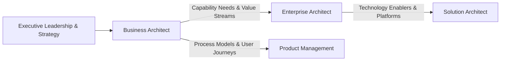

# Role Profile: The Business Architect

The Business Architect bridges corporate executive strategy and technology delivery by modeling the business capabilities, value streams, organizational structures, and business processes that generate enterprise value.

---

## 1. Key Accountabilities
* **Business Capability Modeling**: Build and maintain the enterprise business capability map, ensuring universal naming and functional boundaries.
* **Value Stream Mapping (VSM)**: Map end-to-end customer and operational value streams, identifying handoff delays, cost bottlenecks, and automation opportunities.
* **Strategy-to-Capability Alignment**: Map multi-year corporate strategic objectives to specific capabilities requiring investment, modernization, or outsourcing.
* **Operating Model Design**: Define how business units, shared services, and product teams interact to execute value streams.
* **Business Architecture Heatmaps**: Evaluate business capabilities based on strategic importance, operational maturity, and current technological enablement.

---

## 2. Business Architect Collaboration Matrix

