# Enterprise Security Architecture: Identity & Posture

Treating identity as the new enterprise perimeter across distributed hybrid environments.

---

## 1. Enterprise Identity Federation Architecture

```mermaid
flowchart TD
    User["Employee / Partner / Customer"] --> IdP["Enterprise Identity Provider (Okta / Entra ID)"]
    IdP --> MFA["FIDO2 / WebAuthn Hardware MFA"]
    MFA --> Token["Issue Scoped OIDC / OAuth2 JWT Tokens"]
    Token --> Cloud["Cloud Landing Zones (AWS IAM Identity Center)"]
    Token --> SaaS["Enterprise SaaS (Salesforce, Workday, ServiceNow)"]
    Token --> Gateway["Internal API Gateway & Zero-Trust Service Mesh"]
```

---

## 2. Principles of Enterprise Security Architecture
1. **Never Trust, Always Verify**: Network location (inside corporate VPN or office) grants zero intrinsic trust. Every request must be authenticated, authorized, and encrypted.
2. **Least Privilege by Default**: Access granted on a just-in-time (JIT) basis with automated time-bound expiration.
3. **Defense in Depth**: Layered security across Physical $	o$ Network $	o$ Host $	o$ Container $	o$ Application $	o$ Data $	o$ Human.
