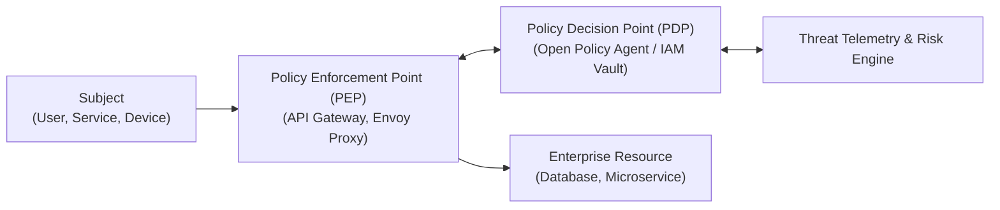

# Zero Trust & Regulatory Compliance

Automating regulatory compliance through architectural fitness functions and Zero Trust policies.

---

## 1. The Zero Trust Security Architecture

---

## 2. Automated Compliance Guardrails
* **PCI-DSS 4.0**: Credit card data isolated in a dedicated tokenization enclave; no plain PAN data in logs or general application databases.
* **GDPR / CCPA**: Right-to-be-forgotten crypto-shredding architecture; PII anonymization proxies in observability pipelines.
* **DORA (Digital Operational Resilience Act)**: Mandatory multi-region disaster recovery testing with zero-data-loss RPO validation.
