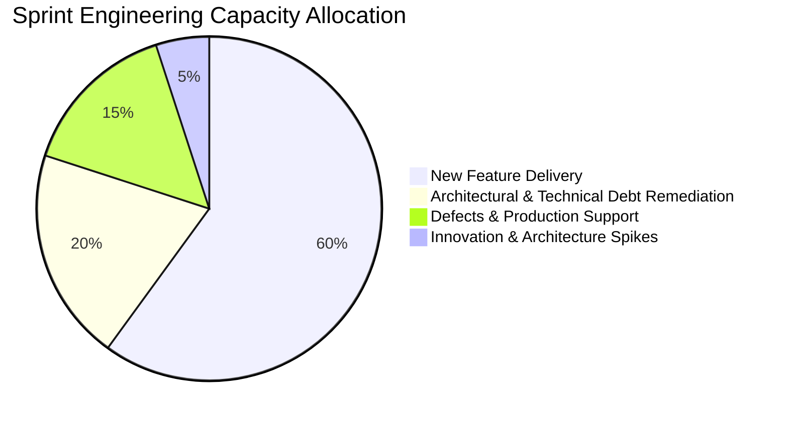

# Debt Reduction Roadmap: The 20% Capacity Rule

How Enterprise Architects secure dedicated engineering capacity to pay down architectural debt.

---

## 1. The 20% Technical Debt Allocation Contract

---

## 2. Overcoming Executive Resistance
When business leaders say *"We don't have time to fix technical debt; we need features"*, the Enterprise Architect must reframe the conversation:
* *Do NOT say*: "Our code is messy and we want to refactor it."
* *DO say*: "Servicing this architectural debt currently consumes 35% of our engineering hours in manual outage recovery. Investing 20% of our capacity to remediate it now will permanently increase feature delivery speed by 40% starting next quarter."
