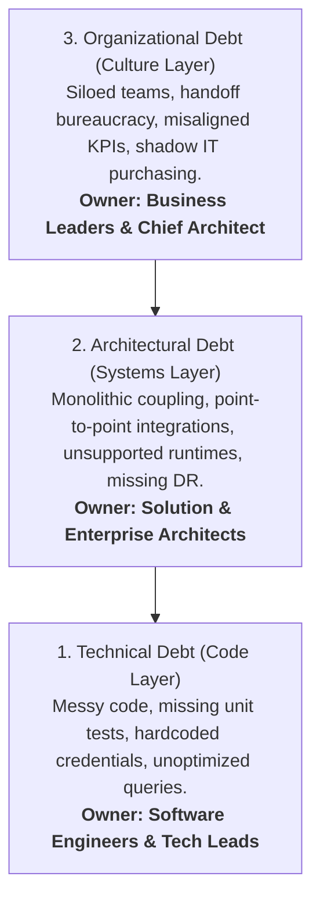

# Enterprise Debt Taxonomy: Technical vs Architectural vs Organizational

Understanding the three distinct layers of enterprise debt.

---

## 1. The 3 Dimensions of Enterprise Debt

---

## 2. Comparative Impact

| Debt Category | Scope | Cost to Remediate | Risk if Ignored |
| :--- | :--- | :---: | :--- |
| **Technical Debt** | Single repository or microservice. | Low (Days / Sprints) | Slower localized sprint velocity; minor software bugs. |
| **Architectural Debt** | Multi-system cross-cutting topology. | High (Months / Quarters) | Systemic cascading outages; inability to scale; massive security breach. |
| **Organizational Debt** | Enterprise operating model. | Very High (Years / Reorgs) | Paralysis of corporate agility; multi-million dollar capability duplication. |
