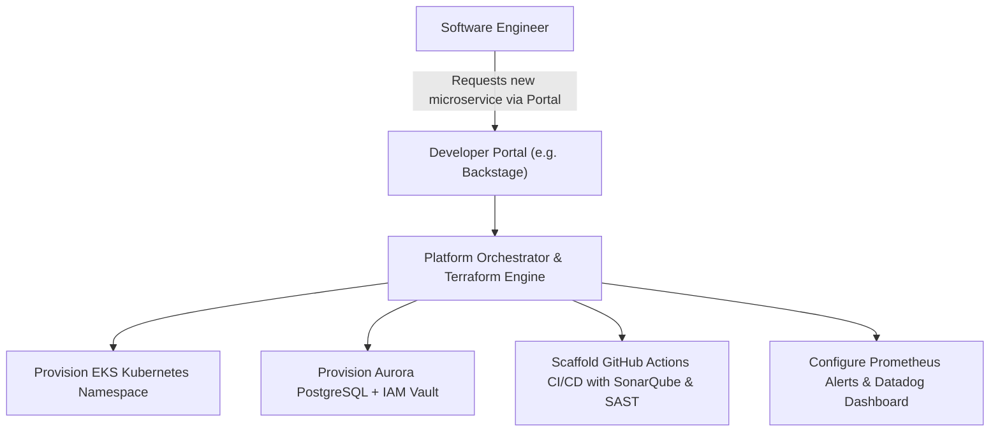

# Enterprise Technology Platforms

How modern enterprises consolidate fragmented infrastructure into unified, self-service developer platforms.

---

## 1. The Internal Developer Platform (IDP) Architecture

* **Outcome**: A developer provisions a secure, compliant, fully observable microservice in 15 minutes instead of waiting 6 weeks for ticket approvals.
