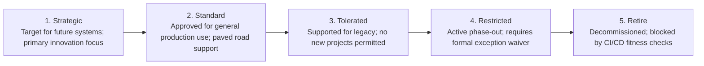

# Technology Lifecycle Tiers

The governance lifecycle that every technology product passes through within an enterprise.

---

## 1. The 5 Technology Lifecycle Tiers

---

## 2. Technology Radar vs Technology Portfolio
* **Technology Radar (Quarterly)**: Tracks *emerging trends* and recommendations (Adopt, Trial, Assess, Hold). (See [TECHNOLOGY-RADAR.md](../../TECHNOLOGY-RADAR.md)).
* **Technology Portfolio (Continuous)**: Manages *existing enterprise reality*—tracking versions, contracts, licenses, CVEs, and retirement pipelines for 100% of installed software.
