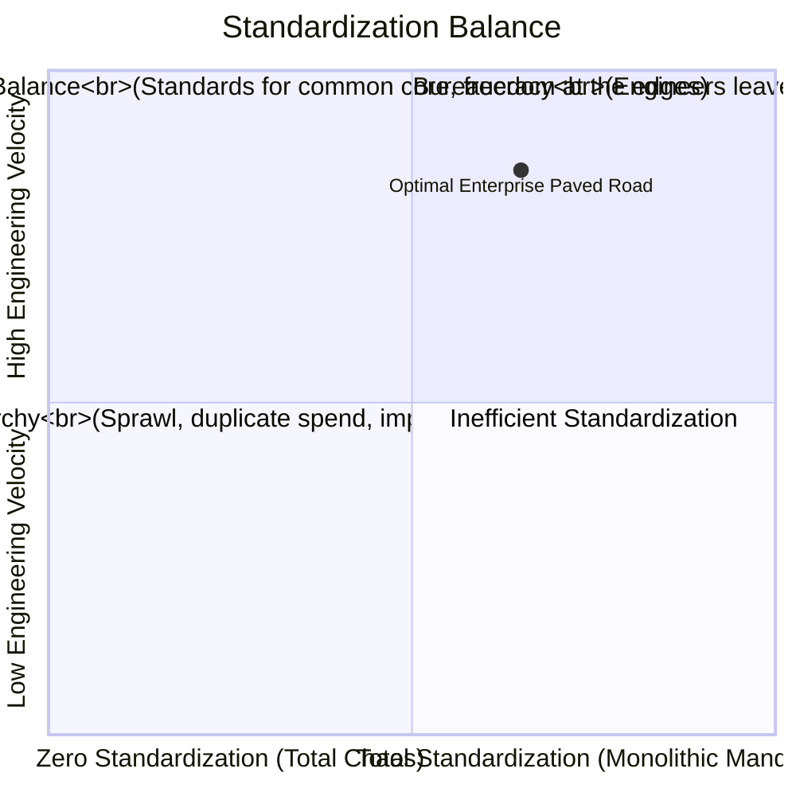

# Technology Standardization Framework

How to calculate the optimal level of technological standardization across an enterprise.

---

## 1. The Standardization Curve: Efficiency vs Innovation

---

## 2. When to Standardize vs When to Diversify
* **Standardize (Commodity Core)**: CI/CD pipelines, identity providers, relational database engines, cloud landing zones, container orchestration.
* **Diversify (Differentiating Edge)**: Specialized machine learning runtimes, high-throughput streaming analytics engines, customer-facing mobile frameworks.
